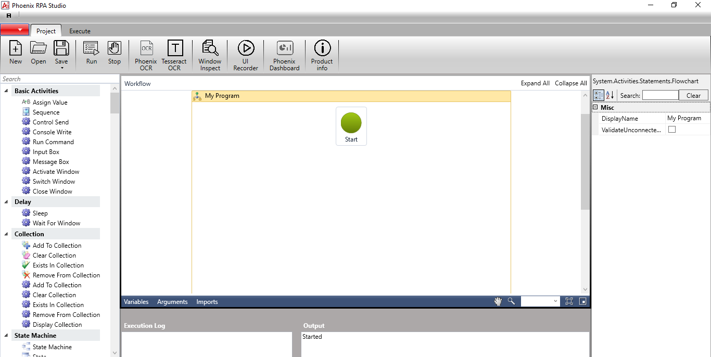

# Ai-Bots Studio

## About

This package contains a Robotic Process Automation (RPA) Studio which enables you to build and manage software Bots which mimicks humans actions interacting with digital systems and software. Just like humans, RPA robots can do things like extracting details on a screen, complete the mouse clicks or keystrokes, navigate through systems, identify and extract data from desktop or web applications, and perform varius other actions. Once trained RPA Bots can do these tasks much faster and consistently than humans

## Running Aibots Studio

You can run the Ai-Bots Studio by opening the source code in a compatible IDE, preferably Microsoft Visual Studio(https://visualstudio.microsoft.com/downloads/)**:

    tesseract imagename outputbase [-l lang] [--oem ocrenginemode] [--psm pagesegmode] [configfiles...]

For more information about the various command line options use `tesseract --help` or `man tesseract`.

Examples can be found in the [documentation](https://tesseract-ocr.github.io/tessdoc/Command-Line-Usage.html#simplest-invocation-to-ocr-an-image).

## For developers

Developers can use `libtesseract` [C](https://github.com/tesseract-ocr/tesseract/blob/master/include/tesseract/capi.h) or
[C++](https://github.com/tesseract-ocr/tesseract/blob/master/include/tesseract/baseapi.h) API to build their own application.
If you need bindings to `libtesseract` for other programming languages, please see the
[wrapper](https://tesseract-ocr.github.io/tessdoc/AddOns.html#tesseract-wrappers) section in the AddOns documentation.

Documentation of Tesseract generated from source code by doxygen can be found on [tesseract-ocr.github.io](https://tesseract-ocr.github.io/).

## Support

Before you submit an issue, please review **[the guidelines for this repository](https://github.com/tesseract-ocr/tesseract/blob/master/CONTRIBUTING.md)**.

For support, first read the [documentation](https://tesseract-ocr.github.io/tessdoc/),
particularly the [FAQ](https://tesseract-ocr.github.io/tessdoc/FAQ.html) to see if your problem is addressed there.
If not, search the [Tesseract user forum](https://groups.google.com/g/tesseract-ocr), the [Tesseract developer forum](https://groups.google.com/g/tesseract-dev) and [past issues](https://github.com/tesseract-ocr/tesseract/issues), and if you still can't find what you need, ask for support in the mailing-lists.

Mailing-lists:
* [tesseract-ocr](https://groups.google.com/g/tesseract-ocr) - For tesseract users.
* [tesseract-dev](https://groups.google.com/g/tesseract-dev) - For tesseract developers.

Please report an issue only for a **bug**, not for asking questions.

## License

    The code in this repository is licensed under the Apache License, Version 2.0 (the "License");
    you may not use this file except in compliance with the License.
    You may obtain a copy of the License at

       http://www.apache.org/licenses/LICENSE-2.0

    Unless required by applicable law or agreed to in writing, software
    distributed under the License is distributed on an "AS IS" BASIS,
    WITHOUT WARRANTIES OR CONDITIONS OF ANY KIND, either express or implied.
    See the License for the specific language governing permissions and
    limitations under the License.

**NOTE**: This software depends on other packages that may be licensed under different open source licenses.

Tesseract uses [Leptonica library](http://leptonica.com/) which essentially
uses a [BSD 2-clause license](http://leptonica.com/about-the-license.html).

## Dependencies

Tesseract uses [Leptonica library](https://github.com/DanBloomberg/leptonica)
for opening input images (e.g. not documents like pdf).
It is suggested to use leptonica with built-in support for [zlib](https://zlib.net),
[png](https://sourceforge.net/projects/libpng) and
[tiff](http://www.simplesystems.org/libtiff) (for multipage tiff).

## Latest Version of README

For the latest online version of the README.md see:

https://github.com/tesseract-ocr/tesseract/blob/master/README.md
