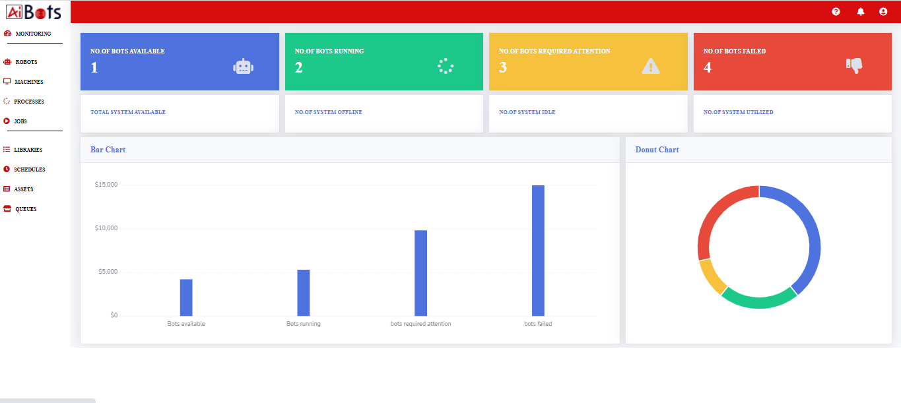

# Ai-Bots Studio

## About

This package contains an RPA orchestrator which is control room that allows you to schedule and launch bots developed using Ai-Bots studio on desktop and virtual machines

Orchestrator is a key tool for your automation management. It enables you the provision to  deploy, trigger, monitor, track, and ensure the security of every Bot. You can manage everything from a web browser. 

## Features and Benefits

- Plays the role of an orchestrator and performs simple tasks like reading the data, data manipulation & writing in the data base.
- Easy integration with multiple technologies in a single environment
- Centralized console to get a single view of status of bots, transactions, performance and utilization etc.
- Vendor independent and highly scalable for other automation opportunities. 

## Running Aibots Orchestrator

You can run the Ai-Bots Orchestrator by opening the [source code](https://github.com/aibotstechrepo/AiBotsOrchestrator) in a compatible IDE, preferably [Microsoft Visual Studio](https://visualstudio.microsoft.com/downloads/):

Once opened you can run the following option in Microsoft Visual Studio to launch the application:

    IIS Express

**NOTE** it is require to enable the IIS option in order to run the Orchestrator

## Support

Please contact us at sales@aibotstech.com to provide us your valuable feedback. You can reach us for any queries related to the product customization

## License

    The code in this repository is licensed under the Apache License, Version 2.0 (the "License");
    you may not use this file except in compliance with the License.
    You may obtain a copy of the License at

       http://www.apache.org/licenses/LICENSE-2.0

    Unless required by applicable law or agreed to in writing, software
    distributed under the License is distributed on an "AS IS" BASIS,
    WITHOUT WARRANTIES OR CONDITIONS OF ANY KIND, either express or implied.
    See the License for the specific language governing permissions and
    limitations under the License.

**NOTE**: This software depends on other packages that may be licensed under different open source licenses.

## Latest Version of README

For the latest online version of the README.md see:

https://github.com/aibotstechrepo/AiBotsStudio/blob/main/README.md

