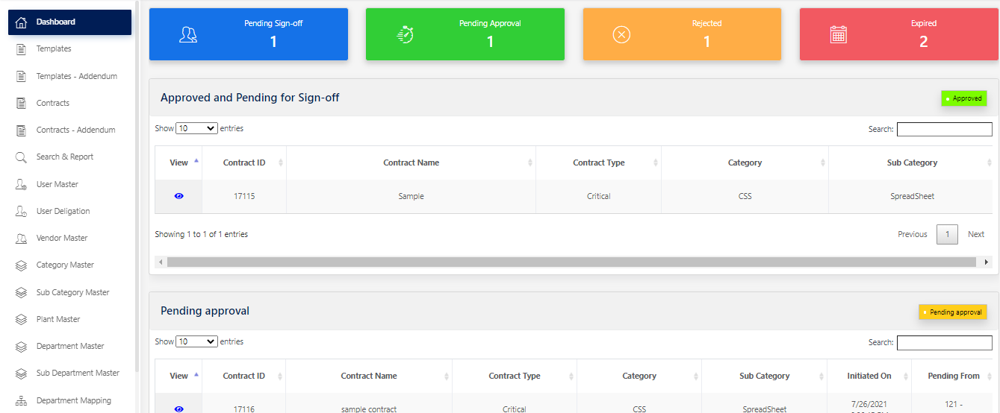

# Contract Management System Instance

## About

This package contains a Contract management System instance which can be used for the management of contracts made with vendors, customers, or employees. Contract management application includes negotiating the terms and conditions in contracts and ensuring compliance with the terms and conditions, as well as documenting and agreeing on any changes or amendments that may arise during its implementation or execution. It can be summarized as the process of systematically and efficiently managing contract creation, execution, and analysis for the purpose of maximizing financial and operational performance and minimizing risk. The purpose of the contract management framework is to provide a clear and standardized approach to managing and administering contracts of the respective Divisions. 

## Features and Benefits

- Template feature is available to minimize the effort of a new contract creation
- A well defined approval workflow can be created to the ensure the quality and accuracy of the contracts 
- Top quality report managment system to manage and maintain the audits
- Role based access to manage the users efficiently and ensure the contract privacy  

## Contract Management System Instance

You can run the Ai-Bots Contract Managment System by opening the [source code](https://github.com/aibotstechrepo/ContractManagementSystem_Instance1) in a compatible IDE, preferably [Microsoft Visual Studio](https://visualstudio.microsoft.com/downloads/):

Once opened you can run the following option in Microsoft Visual Studio to launch the application:

    IIS Express

**NOTE** it is require to enable the IIS option in order to run the Contract Managment System

## Support

Please contact us at sales@aibotstech.com to provide us your valuable feedback. You can reach us for any queries related to the product customization

## License

    The code in this repository is licensed under the Apache License, Version 2.0 (the "License");
    you may not use this file except in compliance with the License.
    You may obtain a copy of the License at

       http://www.apache.org/licenses/LICENSE-2.0

    Unless required by applicable law or agreed to in writing, software
    distributed under the License is distributed on an "AS IS" BASIS,
    WITHOUT WARRANTIES OR CONDITIONS OF ANY KIND, either express or implied.
    See the License for the specific language governing permissions and
    limitations under the License.

**NOTE**: This software depends on other packages that may be licensed under different open source licenses.

## Latest Version of README

For the latest online version of the README.md see:

https://github.com/aibotstechrepo/AiBotsStudio/blob/main/README.md

