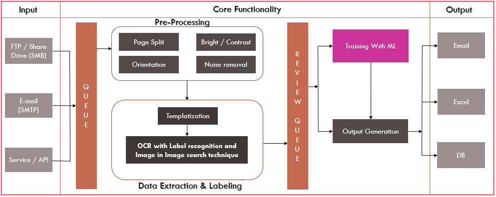

# Ai-Bots Helix OCR

## About

This package contains an Optical Character Recognition Software which allows you to extract information from images and handwritten documents. Helix OCR is a Machine learning enabled enterpise grade platfrom that allows users/companies to automate their business process through AI based cognitive process automation.

Helix OCR leverages advanced machine learning algorithms and natural language processing algorithms to work on unstructured text documents and companies can cover a lager portion of their automation needs without spending months on building business cases or spending time on paperwork to run a pilot.

## Features and Benefits

- Advanced image text detection
- Image in Image search technique 
- Supports mutiple output formats
- Label detection 
- Document text detection
- Supports cloud and on-premise deployment
- Easily Scalable
- Flexible to integrate with any existing system/tools 

## OCR Architecture

## Running Helix OCR

You can run the Ai-Bots Helix OCR by opening the [source code](https://github.com/aibotstechrepo/Helix-Enterprise) in a compatible IDE

Once opened you can run the following command to launch the application:

    python manage.py runserver

**NOTE** it is require to install python 3.X or above and Django framework to run the Helix OCR

## Support

Please contact us at sales@aibotstech.com to provide us your valuable feedback. You can reach us for any queries related to the product customization

## License

    The code in this repository is licensed under the Apache License, Version 2.0 (the "License");
    you may not use this file except in compliance with the License.
    You may obtain a copy of the License at

       http://www.apache.org/licenses/LICENSE-2.0

    Unless required by applicable law or agreed to in writing, software
    distributed under the License is distributed on an "AS IS" BASIS,
    WITHOUT WARRANTIES OR CONDITIONS OF ANY KIND, either express or implied.
    See the License for the specific language governing permissions and
    limitations under the License.

**NOTE**: This software depends on other packages that may be licensed under different open source licenses.

## Latest Version of README

For the latest online version of the README.md see:

https://github.com/aibotstechrepo/AiBotsStudio/blob/main/README.md

